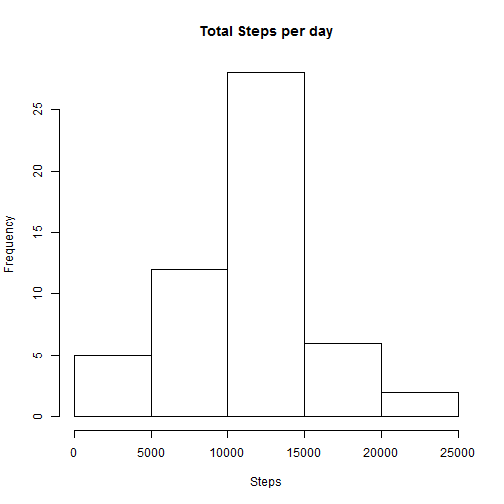
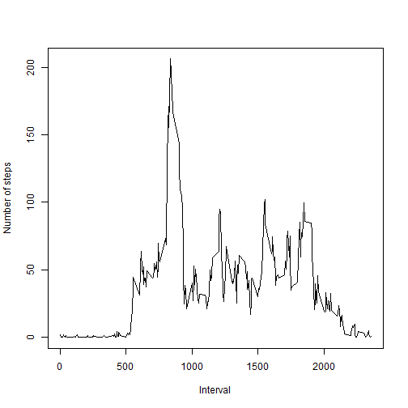
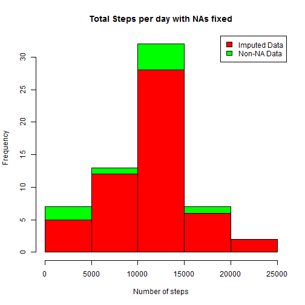
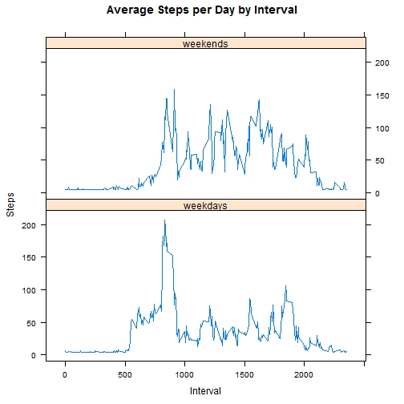

Synopsis
========
1. loading & preprocessing data
2. imputing missing values
3. interpreting data to answer research questions

The variables included in this dataset are:

1. steps: Number of steps taking in a 5-minute interval (missing values are coded as NA)
2. date: The date on which the measurement was taken in YYYY-MM-DD format
3. interval: Identifier for the 5-minute interval in which measurement was taken

Loading and processing data:- 
============================  

```r
x <- read.csv("C:/Users/shreyas/datasciencecoursera/RR/activity.csv")
x$DateTime <- as.POSIXct(x$date, format = "%Y-%m-%d")
library(plyr)
```

What is mean total number of steps taken per day?
=================================================


```r
stepbyday <- aggregate(steps~date, x, sum)
colnames(stepbyday) <- c("date", "steps")
```

Make a histogram of total number of steps taken per day.

```r
hist(stepbyday$steps, breaks = 5, xlab = "Steps", main = "Total Steps per day")
```




Calculate the mean and median of total number of steps taken per day


```r
rmean <- as.integer(mean(stepbyday$steps))
rmedian <- as.integer(median(stepbyday$steps))
```

The mean is 10766 and the median is 10765

What is the average daily activity pattern?
============================================
Time series plot of the 5-minute interval(x-axis) and the average number of steps taken, averaged across all days (y-axis):-

```r
stepsbyinterval <- aggregate(steps~interval, x, mean)
plot(stepsbyinterval$interval, stepsbyinterval$steps, type = "l", xlab = "Interval", ylab = "Number of steps")
```



```r
max <- stepsbyinterval[which.max(stepsbyinterval$steps),1]
```
The 5-minute interval, on average across all the days in the data set, containing the maximum number of steps is 835

Impute missing values 
======================
Calculate number of missing values

```r
a <- x[is.na(x$steps),]
```

Number of missing values are 2304


Missing data to be imputed. This is done by inserting the average for each interval. A data set x is splitted into two parts:- a (contaning NA rows) and b(rest of the rows). 'a' is then filled with average values of interval on the respective dates. The resultant dataset is termed as newa.

```r
b <- na.omit(x)
newa <- transform(a, steps=tapply(a$interval, a$date, na.rm = TRUE))
```

Dataset 'newx' is then created by merging 'newa' and 'b' which has all the NA values filled.

```r
newx <- merge(newa, b, by = c("steps","date","interval"), all = TRUE)
```


Count new total steps by day and create Histogram. Compare it with old histogram.

```r
newsteps <- aggregate(steps~date, newx, sum)
hist(newsteps$steps, col = "green", xlab = "Number of steps", main = "Total Steps per day with NAs fixed")
hist(stepbyday$steps, col = "red", xlab = "Number of steps", add = T)
legend("topright", c("Imputed Data", "Non-NA Data"), fill=c("red", "green") )
```



New mean and median for imputed data:

```r
nmean <- as.integer(mean(newsteps$steps))
nmedian <- as.integer(median(newsteps$steps))
```
New mean is 10595 and new median is 10765

Difference between new and old mean and median

```r
dmean <- nmean-rmean
dmedian <- nmedian-rmedian
```

Total Difference

```r
TotalDiff <- sum(newsteps$steps)-sum(stepbyday$steps)
```

1. Imputed data mean : 10595
2. Imputed data median: 10765
3. Difference between the imputed and non-imputed mean : -171
4. Difference between the imputed and non-imputed median : 0
5. Difference between total number of steps between imputed and non-imputed data is 75744. Thus, there were 75744 more steps in imputed data.


Are there differences in activity patterns between weekdays and weekends?
=========================================================================

New factor variable in the dataset with two levels is being created - "weekday" and "weekend" indicating whether a given date is a weekday or weekend day. A time series plot of the 5-minute interval (x-axis) and the average number of steps taken, averaged across all weekday days & weekend days (y-axis) is drawn.

```r
newx$day <- weekdays(as.Date(newx$date))
weekends <- c("Saturday","Sunday")
newx$daytype <- as.factor(ifelse(is.element(newx$day, weekends),"weekends","weekdays"))
w <- aggregate(steps~interval+daytype, newx, mean)
library(lattice)
xyplot(w$steps~w$interval|w$daytype, layout=c(1,2), type = "l",xlab="Interval", ylab="Steps", main="Average Steps per Day by Interval")
```


